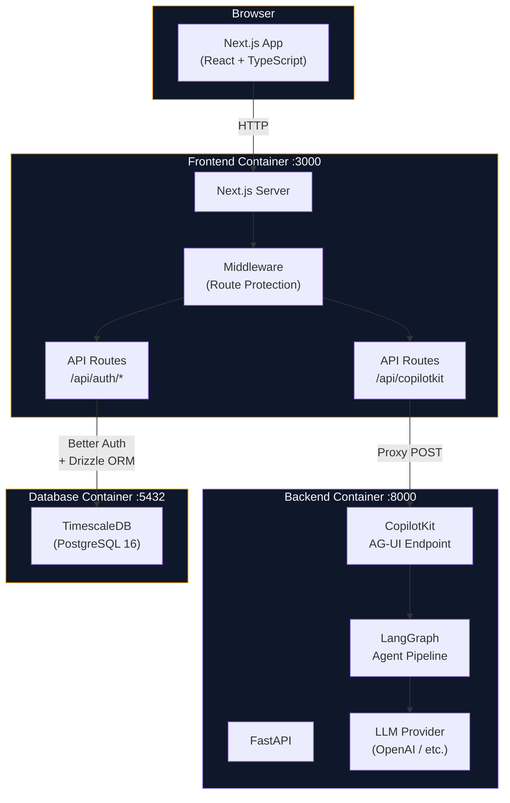

# Boilerplate Project

## Project Overview

A production-ready full-stack boilerplate for building AI-powered applications. Provides a pre-wired integration between a Next.js frontend and a FastAPI backend, with self-hosted authentication (Better Auth + Drizzle ORM), an agentic AI pipeline (LangGraph + CopilotKit), and a TimescaleDB database -- all containerized with Docker Compose for reproducible local development and straightforward deployment.

## Project-Specific Rules

> General coding style, testing, security, and git workflow rules are defined in `~/.claude/rules/`.
> Only project-specific overrides and additions belong here.

- Organize by **feature/domain**, not by type (e.g., `components/auth/`, `agent/`, not `components/`, `utils/`)
- Frontend validation uses **Zod** schemas; backend validation uses **Pydantic** models
- Auth logic lives exclusively in the **frontend** (Next.js API routes + Drizzle); the backend handles **AI/ML only**
- All CopilotKit traffic flows through the Next.js `/api/copilotkit` proxy -- the FastAPI backend is never exposed directly to the browser

---

## Project Structure

```
boilerplate/
├── .env.example                    # All required environment variables
├── docker-compose.yml              # Three-service orchestration
├── scripts/
│   └── init-db.sql                 # TimescaleDB extension init
│
├── frontend/                       # Next.js (App Router)
│   ├── Dockerfile
│   ├── drizzle.config.ts
│   ├── vitest.config.ts
│   ├── src/
│   │   ├── app/                    # Pages and API routes
│   │   │   ├── (auth)/             # Sign-in, sign-up pages
│   │   │   ├── dashboard/          # Authenticated dashboard
│   │   │   ├── chat/               # CopilotKit chat page
│   │   │   └── api/                # Auth + CopilotKit proxy routes
│   │   ├── components/             # UI components by domain
│   │   ├── db/schema/              # Drizzle schema (auth tables)
│   │   ├── hooks/                  # Custom React hooks
│   │   └── lib/                    # Auth, DB, and utility modules
│   └── __tests__/
│
├── backend/                        # FastAPI (Python)
│   ├── Dockerfile
│   ├── pyproject.toml
│   ├── src/
│   │   ├── main.py                 # App entry point + CopilotKit endpoint
│   │   ├── config.py               # Pydantic Settings
│   │   ├── agent/                  # LangGraph pipeline
│   │   └── api/                    # REST endpoints
│   └── tests/
```

---

## Design System

The UI is a **dark, professional trading aesthetic** — high contrast, information-dense, no decorative clutter. The visual identity uses a dual-color system: **amber for strategy/action** and **violet for mind/psychology**.

---

### Theme Architecture

Theme variables live in `frontend/src/globals.css` as OKLCH CSS custom properties. ShadCN components consume them via `--primary`, `--secondary`, etc. Raw Tailwind color classes (`amber-*`, `violet-*`, `slate-*`) are used directly for glows, gradients, and decorative elements.

```
globals.css (oklch vars)
    └── @theme inline → Tailwind color tokens (color-primary, color-secondary, …)
        └── ShadCN components (Button variant="default" → bg-primary, etc.)
```

**Two separate color systems are used intentionally:**
- **ShadCN theme vars** (`bg-primary`, `text-secondary-foreground`) — for interactive UI components (Button, Input, Card)
- **Raw Tailwind classes** (`bg-amber-600`, `text-violet-400`) — for marketing surfaces, glows, gradients, and decorative accents

---

### Color Palette

#### Dark Surfaces (always use these for backgrounds)

| Role | Class | Hex |
|------|-------|-----|
| Page background | `bg-slate-950` or `bg-[#020617]` | `#020617` |
| Card / panel | `bg-slate-900` / `bg-slate-900/40` | `#0F172A` |
| Input / subtle | `bg-slate-900` | `#0F172A` |
| Default border | `border-slate-800` | `#1E293B` |
| Dim text | `text-slate-400` | `#94A3B8` |
| Faint text / meta | `text-slate-500` | `#64748B` |

#### Amber — Strategy, Action, The General

| Use | Class |
|-----|-------|
| Logo, brand accent | `from-amber-400 to-amber-700` (gradient) |
| Primary CTA button | `bg-amber-600 hover:bg-amber-500` |
| Headline gradient | `from-amber-200 via-amber-400 to-amber-700` |
| Active tab | `bg-amber-600` |
| Icon / label | `text-amber-500` |
| Ambient glow | `bg-amber-600/10 blur-[120px]` |
| Active border | `border-amber-500/20` |
| Carousel dots | `bg-amber-500` (active), `bg-slate-800` (inactive) |
| Attribution / byline | `text-amber-500` |

#### Violet — Mind, Psychology, The Philosopher

| Use | Class |
|-----|-------|
| Active tab | `bg-violet-600` |
| Icon / label | `text-violet-400` |
| Feature card hover border | `hover:border-violet-500/30` |
| Icon bg | `bg-violet-500/10 border-violet-500/20` |
| Headline gradient | `from-violet-200 via-violet-400 to-indigo-500` |
| Ambient glow | `bg-violet-600/10 blur-[120px]` |
| Progress bar fill | `from-violet-500 to-red-500` (critical state) |
| Badge / tag | `bg-violet-500/10 border-violet-500/20 text-violet-400` |
| Subtle panel bg | `bg-violet-500/5 border-violet-500/10` |

---

### Typography

| Usage | Classes | Notes |
|-------|---------|-------|
| Hero headline | `font-bold tracking-tighter leading-[1.05]` | 5xl–8xl, white or gradient |
| Section heading | `font-bold tracking-tight` | 3xl–5xl |
| Nav / labels | `font-bold uppercase tracking-widest text-xs` | All-caps, wide spacing |
| Monospace / logs | `font-mono text-[10px] uppercase tracking-widest` | Status labels, telemetry |
| Serif / quotes | `font-serif italic` | Blockquotes, pull quotes |
| Body copy | `font-light leading-relaxed text-slate-400` | Subdued, never pure white |

Fonts are configured in `globals.css`:
- `--font-sans`: Inter (headings, body)
- `--font-serif`: Georgia (quotes, italic callouts)
- `--font-mono`: JetBrains Mono (code, status labels)

---

### Key Patterns

#### Ambient Glow (hero, CTA backgrounds)
```tsx
<div className="absolute inset-0 pointer-events-none">
  <div className="absolute top-1/4 left-1/3 -translate-x-1/2 w-[600px] h-[400px] bg-amber-600/10 blur-[120px] rounded-full" />
  <div className="absolute top-1/3 right-1/4 translate-x-1/2 w-[600px] h-[400px] bg-violet-600/10 blur-[120px] rounded-full" />
</div>
```

#### Feature Card
```tsx
<div className="rounded-3xl border border-slate-800 bg-slate-950/50 p-10 flex flex-col gap-6 hover:border-violet-500/30 transition-colors group">
  <div className="w-14 h-14 rounded-2xl bg-violet-500/10 border border-violet-500/20 flex items-center justify-center text-violet-400 group-hover:scale-110 transition-transform">
    <Icon size={28} />
  </div>
  <h3 className="text-2xl font-bold text-white">Title</h3>
  <p className="text-slate-400 leading-relaxed">Description.</p>
</div>
```

#### Badge / Tag (inline — no ShadCN Badge component)
```tsx
<span className="inline-flex items-center gap-1.5 px-3 py-1 rounded-full bg-violet-500/10 border border-violet-500/20 text-violet-400 text-[10px] font-bold uppercase tracking-[0.2em]">
  Label
</span>
```

#### Tab Switcher (amber / violet)
```tsx
<div className="flex bg-slate-900/50 p-1 rounded-3xl">
  <button className={`flex-1 py-3 text-[10px] font-black tracking-[0.2em] rounded-2xl transition-all ${
    active === "a" ? "bg-amber-600 text-white shadow-lg" : "text-slate-500 hover:text-slate-300"
  }`}>THE GENERAL</button>
  <button className={`flex-1 py-3 text-[10px] font-black tracking-[0.2em] rounded-2xl transition-all ${
    active === "b" ? "bg-violet-600 text-white shadow-lg" : "text-slate-500 hover:text-slate-300"
  }`}>THE PHILOSOPHER</button>
</div>
```

#### ShadCN Button — when to use
Use ShadCN `Button` when the element **navigates** (paired with `asChild` + Next.js `Link`) or needs standard interactive variants (`outline`, `ghost`, `secondary`). Use native `<button>` with raw Tailwind for custom-styled CTAs (amber/violet pills, dark rounded-full variants).

---

### Changing the Theme

The primary and secondary hue pair is defined once in `frontend/src/globals.css`:

```css
:root {
  --primary: oklch(0.75 0.18 55);   /* hue 55 = amber */
  --secondary: oklch(0.55 0.2 290); /* hue 290 = violet */
}
.dark {
  --primary: oklch(0.75 0.18 55);
  --secondary: oklch(0.55 0.2 290);
}
```

**To swap the accent color pair**, change the hue values (third parameter in `oklch`):

| Color | Hue |
|-------|-----|
| Amber / Gold | `55` |
| Orange | `35` |
| Green / Emerald | `145` |
| Teal / Cyan | `195` |
| Blue | `230` |
| Violet / Purple | `290` |
| Pink / Rose | `350` |

Example — switching to **teal + blue**:
```css
--primary: oklch(0.75 0.18 195);   /* teal */
--secondary: oklch(0.55 0.2 230);  /* blue */
```

After changing the CSS vars, also update any **hardcoded raw Tailwind classes** in the page components — search for `amber-` and `violet-` and replace with the corresponding Tailwind color scale for your new hues. The glow divs, gradient spans, badge borders, and tab switcher backgrounds all use raw classes and must be updated manually.

---

## Tech Stack

#### Architecture Diagram



#### Frontend (`frontend/`)

| Layer | Technology | Purpose |
|-------|-----------|---------|
| Framework | **Next.js** (App Router) | Server-side rendering, API routes, middleware |
| Language | **TypeScript** | Type safety across the entire frontend |
| UI Components | **Shadcn/ui** + **Tailwind CSS** | Accessible, composable component library with utility-first styling |
| Icons | **Lucide-React** | Consistent, tree-shakeable icon set |
| Forms | **React Hook Form** + **Zod** | Performant form state management with schema-based validation |
| Authentication | **Better Auth** (self-hosted) | Email/password auth running in Next.js API routes |
| ORM | **Drizzle ORM** | Type-safe database access for auth schema |
| AI Interface | **CopilotKit** (React SDK) | Pre-built chat UI and frontend AI integration |
| Testing | **Vitest** + **Testing Library** | Unit and component testing |
| Package Manager | **pnpm** | Fast, disk-efficient dependency management |

#### Backend (`backend/`)

| Layer | Technology | Purpose |
|-------|-----------|---------|
| Framework | **FastAPI** | High-performance async Python API server |
| AI Orchestration | **LangGraph** | Stateful, graph-based agentic workflows |
| AI Integration | **CopilotKit** (Python SDK) | Exposes LangGraph agents to the frontend via CopilotKit protocol |
| LLM Access | **LangChain** + **OpenAI** | Unified interface to LLM providers |
| Configuration | **Pydantic Settings** | Type-safe environment variable management |
| Testing | **Pytest** | Unit and integration testing |
| Package Manager | **uv** | Fast Python dependency management and virtual environments |

#### Infrastructure

| Component | Technology | Purpose |
|-----------|-----------|---------|
| Database | **TimescaleDB** (PostgreSQL 16) | Relational storage with time-series extensions |
| Containerization | **Docker Compose** | Three-service orchestration (frontend, backend, db) |
| Dev Workflow | Hot-reload mounts | Source directories mounted into containers for live reloading |

---

## Integration Gotchas

#### CopilotKit + LangGraph (AG-UI Protocol)

- **Backend endpoint:** Use `add_langgraph_fastapi_endpoint` from `ag_ui_langgraph`, NOT `add_fastapi_endpoint` from `copilotkit.integrations.fastapi` -- the old function calls `dict_repr()` which doesn't exist on `LangGraphAGUIAgent`
- **Backend checkpointer:** `LangGraphAGUIAgent` requires a checkpointer on the compiled graph (use `MemorySaver()` for dev) -- its `run()` method calls `aget_state` which fails without one
- **Frontend route:** The `/api/copilotkit` route must use `CopilotRuntime` + `HttpAgent` from `@copilotkit/runtime` and `@ag-ui/client`, NOT a raw `fetch` proxy
- **Agent name consistency:** The agent key in `CopilotRuntime({ agents: { chat_agent } })` must match the `name` in `LangGraphAGUIAgent(name="chat_agent")` and the `<CopilotKit agent="chat_agent">` prop

#### Environment Variables

- `dotenv.load_dotenv()` MUST be the first call in `backend/src/main.py`, BEFORE any LangChain/OpenAI imports -- `ChatOpenAI` reads `OPENAI_API_KEY` at import time
- The `.env` file lives at the project root; `frontend/.env` and `backend/.env` are symlinks to it
- `drizzle.config.ts` needs `import "dotenv/config"` at the top to load env vars