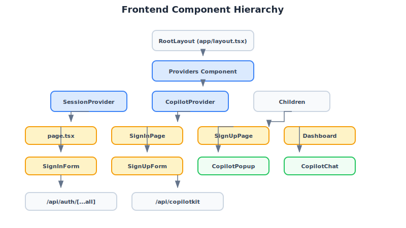

# Component Architecture

This document describes the frontend component structure and patterns used in the boilerplate.

## Directory Structure

```
frontend/src/components/
├── chat/
│   └── copilot-chat.tsx       # AI chat UI component
├── providers/
│   └── copilot-provider.tsx   # CopilotKit context provider
├── ui/                        # ShadCN/ui components
│   ├── button.tsx
│   ├── input.tsx
│   ├── label.tsx
│   └── ...
└── auth/
    ├── sign-in-form.tsx
    ├── sign-up-form.tsx
    └── use-auth.ts
```

## Component Hierarchy



## Core Components

### CopilotProvider

**Location**: `frontend/src/components/providers/copilot-provider.tsx`

Wraps the application with CopilotKit context, enabling AI chat functionality throughout the app.

```tsx
import { CopilotKit } from "@copilotkit/react-core"
import { CopilotPopup } from "@copilotkit/react-ui"

export function Providers({ children }) {
  return (
    <CopilotKit runtimeUrl="/api/copilotkit" agent="chat_agent">
      {children}
    </CopilotKit>
  )
}
```

**Props**:
- `runtimeUrl`: Points to Next.js API route that proxies to backend
- `agent`: Agent name matching backend configuration

### CopilotChat

**Location**: `frontend/src/components/chat/copilot-chat.tsx`

The chat UI component that provides the conversational interface.

```tsx
import { CopilotPopup } from "@copilotkit/react-ui"

export function CopilotChat() {
  return <CopilotPopup labels={{ title: "AI Assistant" }} />
}
```

### Auth Forms

**Sign In**: `frontend/src/components/auth/sign-in-form.tsx`
**Sign Up**: `frontend/src/components/auth/sign-up-form.tsx`

Both forms use:
- React Hook Form for state management
- Zod for validation
- Server actions for submission

## Providers Setup

**File**: `frontend/src/app/providers.tsx`

```tsx
"use client"

import { SessionProvider } from "@/hooks/use-auth"
import { CopilotProvider } from "@/components/providers/copilot-provider"

export function Providers({ children }) {
  return (
    <SessionProvider>
      <CopilotProvider>
        {children}
      </CopilotProvider>
    </SessionProvider>
  )
}
```

Wrapped in `layout.tsx`:

```tsx
import { Providers } from "./providers"

export default function RootLayout({ children }) {
  return (
    <html lang="en">
      <body>
        <Providers>{children}</Providers>
      </body>
    </html>
  )
}
```

## Next Steps

- [CopilotProvider Details](../components/copilot-provider.md)
- [CopilotChat Details](../components/copilot-chat.md)
- [Authentication Components](../components/auth.md)
