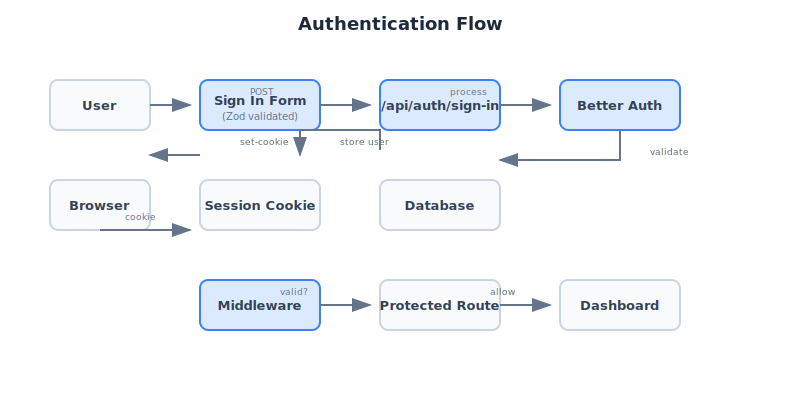
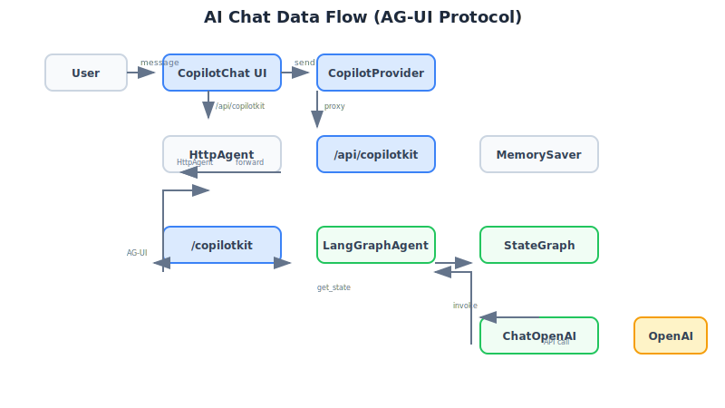
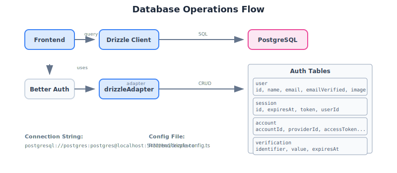

# Data Flow

This document details how data flows through the system for different types of requests.

## Data Flow Diagrams

### Authentication Flow



### AI Chat Flow



### Database Operations



## Authentication Data Flow

```
1. User submits sign-up form
   └─> POST /api/auth/sign-up (Zod validated)
       └─> Better Auth creates user in DB
           └─> Session cookie set in response

2. User submits sign-in form
   └─> POST /api/auth/sign-in
       └─> Better Auth validates credentials
           └─> Session cookie set in response

3. Subsequent requests
   └─> Browser sends cookie with request
       └─> Middleware validates session
           └─> User authenticated or redirect
```

## AI Chat Data Flow

The AI chat uses the AG-UI Protocol through CopilotKit:

```
1. User types message in CopilotChat
   └─> CopilotKit sends to /api/copilotkit
       └─> Next.js API route (HttpAgent)
           └─> Proxies to http://localhost:8000/copilotkit
               └─> FastAPI endpoint (add_langgraph_fastapi_endpoint)
                   └─> LangGraphAGUIAgent.run()
                       └─> LangGraph StateGraph processes
                           └─> ChatOpenAI (gpt-4o-mini) generates response
                               └─> Response streams back

2. Response flows reverse direction
   └─> Streaming tokens back to frontend
       └─> CopilotKit renders in chat UI
```

### Key Integration Points

| Component | File | Purpose |
|-----------|------|---------|
| CopilotProvider | `frontend/src/components/providers/copilot-provider.tsx` | Wraps app with CopilotKit context |
| CopilotChat | `frontend/src/components/chat/copilot-chat.tsx` | Chat UI component |
| API Route | `frontend/src/app/api/copilotkit/route.ts` | Proxies to backend |
| Agent | `backend/src/agent/graph.py` | LangGraph StateGraph |
| Node | `backend/src/agent/nodes.py` | ChatOpenAI integration |

## Database Data Flow

```
1. Frontend creates Drizzle client
   └─> lib/db.ts creates postgres connection
       └─> DATABASE_URL from environment

2. Better Auth uses Drizzle adapter
   └─> drizzleAdapter with pg provider
       └─> All auth operations go through Drizzle

3. Schema defined in frontend/src/db/schema/
   └─> auth.ts - User, Session, Account, Verification
       └─> Exported from index.ts
```

## Environment Variable Flow

```
.env file
    |
    +--> Frontend (via dotenv symlink)
    |       - NEXT_PUBLIC_* exposed to browser
    |       - BETTER_AUTH_* for auth config
    |       - DATABASE_URL for Drizzle
    |
    +--> Backend (via dotenv symlink)
            - OPENAI_API_KEY for LLM
            - DATABASE_URL for any DB ops
            - Other service config
```

## Next Steps

- [Component Architecture](./components.md) - Frontend details
- [Agent Pipeline](./agent.md) - LangGraph details
- [API Reference](../api/rest.md) - REST endpoints
