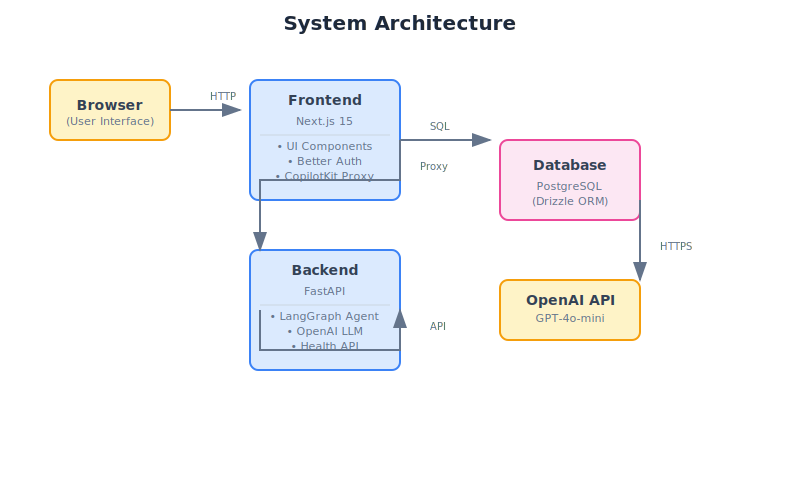

# System Architecture Overview

This document describes the high-level architecture of the AI-powered full-stack boilerplate.

## Architecture Diagram



## Core Principles

1. **Separation of Concerns**: Frontend handles UI and auth; Backend handles AI/ML
2. **Security by Design**: Backend AI services never exposed directly to browser
3. **Type Safety**: Full TypeScript/Python type safety end-to-end
4. **Production-Ready**: Docker Compose orchestration, health checks, proper error handling

## System Components

### Frontend (Next.js)

The frontend is responsible for:
- User interface and interactions
- Authentication (Better Auth)
- Database operations (Drizzle ORM)
- AI request proxying (CopilotKit)

**Location**: `frontend/src/`

### Backend (FastAPI)

The backend is responsible for:
- AI agent orchestration (LangGraph)
- LLM interactions (OpenAI)
- Health checks and monitoring

**Location**: `backend/src/`

### Database (PostgreSQL/TimescaleDB)

The database stores:
- User accounts and sessions
- OAuth credentials
- Email verification tokens

**Location**: Managed via Docker, accessible on port 5432

## Service Communication

```
Browser <-> Frontend (Next.js) <-> Backend (FastAPI) <-> OpenAI API
                |
                v
            Database (PostgreSQL)
```

### Request Flow

1. **UI Request**: User interacts with Next.js frontend
2. **Auth Check**: Better Auth middleware validates session
3. **API Call**: Frontend calls internal API routes or proxies to backend
4. **AI Processing**: Backend LangGraph agent processes request
5. **Response**: Data flows back through the chain

## Security Architecture

### Authentication Flow

1. User submits credentials to `/api/auth/sign-in`
2. Better Auth validates and creates session
3. Session cookie stored in browser
4. Middleware validates session on protected routes

### AI Request Proxy

1. Frontend sends AI request to `/api/copilotkit`
2. Next.js API route proxies to backend (`http://localhost:8000/copilotkit`)
3. Backend processes with LangGraph + OpenAI
4. Response streams back through proxy
5. Frontend CopilotKit renders in UI

**Note**: Backend is never exposed to the public internet - all AI traffic goes through the frontend proxy.

## Environment Architecture

```
.env (root)
    |
    +-- frontend/.env (symlink)
    +-- backend/.env (symlink)
```

All services share the same environment variables via symlinked `.env` files.

## Next Steps

- [Data Flow Diagram](./data-flow.md) - Detailed request/response flow
- [Component Architecture](./components.md) - Frontend structure
- [Agent Pipeline](./agent.md) - AI agent details
